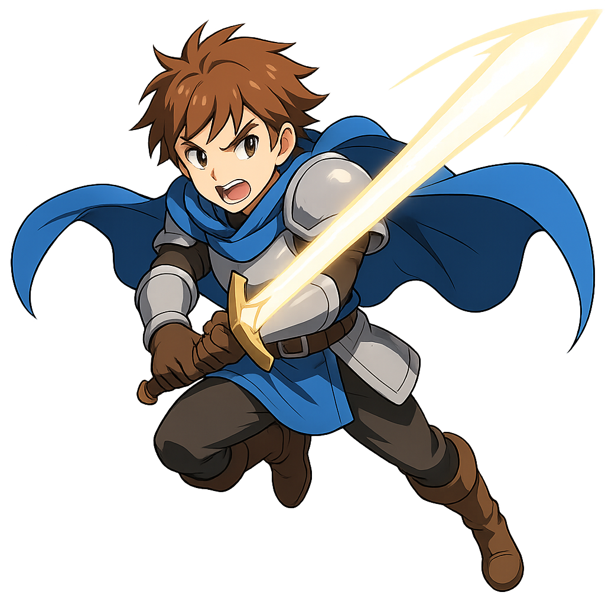

# RPG 網頁遊戲專案報告

## 一、專案名稱

**RPG 角色狀態展示與攻擊互動系統（HTML/JS）**

## 二、專案介紹

本專案為一個基礎 RPG 遊戲網頁介面，使用 HTML、CSS、JavaScript 製作。使用者可切換角色，查看角色資訊，並透過「攻擊」按鈕執行動畫與顯示隨機傷害。此專案可作為遊戲介面設計、網頁互動教學的起始範例。

## 三、功能總覽與實作說明

### 1. 角色選擇功能

**功能說明：** 使用者可從下拉選單中切換角色，目前預設有「勇者艾爾」與「法師莉娜」。

**HTML**
```html
<select id="characterSelect">
  <option value="hero">勇者艾爾</option>
  <option value="mage">法師莉娜</option>
</select>
```

**JavaScript**
```js
document.getElementById("characterSelect").addEventListener("change", function() {
  loadCharacter(this.value);
});
```

### 2. 顯示角色資訊

**功能說明：** 畫面中會顯示角色的技能、背包、攻擊招式、防禦力與生命值。

**角色資料儲存方式**
```js
const characters = {
  hero: {
    name: "勇者艾爾",
    image: "hero.png",
    skills: ["火焰術", "冰霜護盾"],
    inventory: ["治癒藥水", "鋼劍"],
    attacks: ["斬擊", "火焰彈"],
    defense: 12,
    health: 100
  },
  mage: {
    name: "法師莉娜",
    image: "mage.png",
    skills: ["閃電鏈", "魔力屏障"],
    inventory: ["魔法書", "法杖"],
    attacks: ["雷擊", "寒冰箭"],
    defense: 8,
    health: 80
  }
};
```

**資料讀取函式**
```js
function loadCharacter(id) {
  const c = characters[id];
  document.getElementById("charName").textContent = c.name;
  document.getElementById("charImage").src = c.image;
  document.getElementById("skills").textContent = c.skills.join(", ");
  document.getElementById("inventory").textContent = c.inventory.join(", ");
  document.getElementById("attacks").textContent = c.attacks.join(", ");
  document.getElementById("defense").textContent = c.defense;
  document.getElementById("health").textContent = c.health;
}
```

### 3. 攻擊動畫與傷害顯示

**功能說明：** 點擊攻擊按鈕後，會顯示動畫圖像（例如揮劍），並在畫面上方顯示隨機傷害數字。

**HTML 元件**
```html
<button onclick="attack()">攻擊</button>
<p id="battleLog"></p>

```

**CSS 動畫樣式**
```css
#attackImage {
  position: absolute;
  opacity: 0;
  transition: opacity 0.2s;
}
.show {
  opacity: 1 !important;
}
```

**JavaScript 動畫控制**
```js
function attack() {
  const dmg = Math.floor(Math.random() * 20) + 5;
  document.getElementById("battleLog").textContent = "你對敵人造成了 " + dmg + " 點傷害！";

  const img = document.getElementById("attackImage");
  img.classList.add("show");
  setTimeout(() => img.classList.remove("show"), 300);
}
```

### 4. 純前端結構

本專案完全使用 HTML、CSS、JavaScript 開發，無需伺服器或資料庫，適合初學者部署與學習。

## 四、檔案結構

```
rpg-game/
│
├── index.html          ← 主網頁程式
├── hero.png            ← 勇者角色圖
├── mage.png            ← 法師角色圖
└── attack.png          ← 攻擊動畫圖（透明背景）
```

## 五、執行方式

將所有檔案放入同一資料夾。

雙擊 index.html 以瀏覽器開啟。

可直接使用，不需任何伺服器安裝。

## 六、未來擴充建議

- 敵人角色與攻擊回應邏輯
- 音效與背景音樂
- Canvas 動畫取代圖片動畫
- 裝備系統與經驗值升級
- 多語系切換功能

## 七、授權聲明

本專案為學習用途範例，可自由修改與使用。圖像如有來自第三方資源，請遵守原始授權條件。

